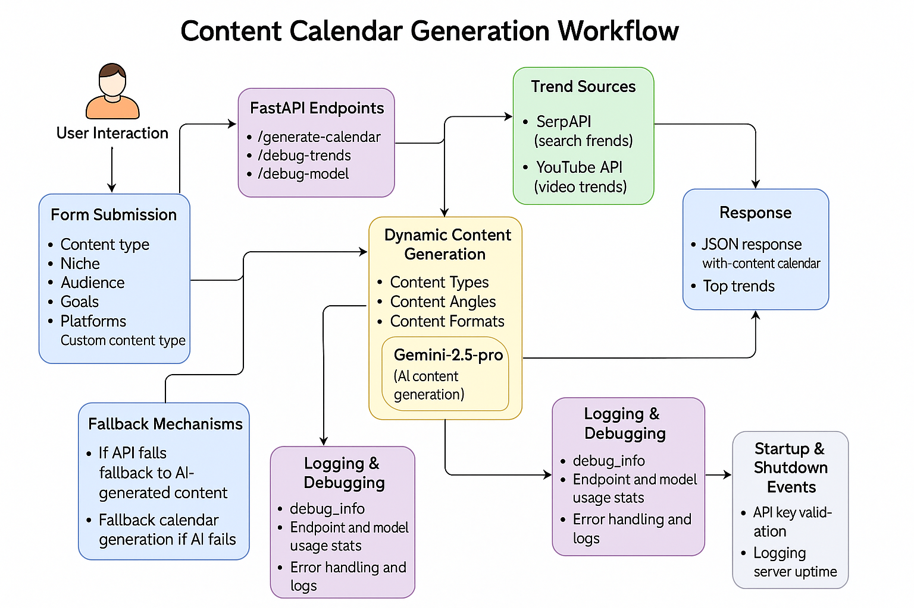

# AI Content Platform

This project is an AI-powered content generation platform built with FastAPI, designed to help creators generate 30-day content calendars using real-time trends from Google and YouTube, AI-driven content suggestions, and dynamic content angles, types, and formats.

---

## Features

* **Generate 30-day content calendars** with titles, descriptions, tags, and platform-specific recommendations.
* **Integrates multiple APIs:**

  * Gemini (Google Generative AI) for AI-powered content generation.
  * SerpAPI for trending search data.
  * YouTube API for trending videos.
* **Dynamic content suggestions:** Content types, content angles, and formats are dynamically generated based on the niche and audience.
* **Caching:** User content calendars and dynamic content are cached for performance and to reduce API calls.
* **Fallback Mechanisms:** AI-generated content is used if APIs fail.
* **Debugging & Monitoring:** Endpoints to test API keys, trends, and AI model functionality.
* **Statistics & Health Checks:** Track usage, uptime, and system health.

---

## Tech Stack

* **Backend:** Python, FastAPI, Pydantic
* **AI:** Google Gemini (Gemini-2.5-pro)
* **API Integration:** SerpAPI, YouTube Data API
* **Async HTTP:** aiohttp
* **Logging:** Python's logging module with UTF-8 encoding support
* **Caching:** In-memory dictionary with time-based expiration
* **Prompting & Output Parsing:** LangChain, RunnableLambda, JsonOutputParser
* **Retries & Fault Tolerance:** Tenacity
* **Frontend Templates:** Jinja2 (HTML)

---

## Requirements

* Python 3.11+
* Dependencies listed in `requirements.txt`:

  ```
  fastapi
  uvicorn
  python-dotenv
  google-generativeai
  langchain
  langchain-google-genai
  aiohttp
  serpapi
  tenacity
  pydantic
  ```
* API Keys:

  * `GEMINI_API_KEY`
  * `SERPAPI_KEY`
  * `YOUTUBE_API_KEY`

---

## Setup Instructions

1. **Clone the repository**

```bash
git clone https://github.com/yourusername/ai-content-platform.git
cd ai-content-platform
```

2. **Create and activate a virtual environment**

```bash
python -m venv venv
source venv/bin/activate   # Linux/macOS
venv\Scripts\activate    # Windows
```

3. **Install dependencies**

```bash
pip install -r requirements.txt
```

4. **Create a `.env` file** in the root directory and add your API keys:

```env
GEMINI_API_KEY=your_gemini_key
SERPAPI_KEY=your_serpapi_key
YOUTUBE_API_KEY=your_youtube_key
PORT=8000
HOST=0.0.0.0
```

5. **Run the application**

```bash
uvicorn main:app --reload --host 0.0.0.0 --port 8000
```

* Access the platform at `http://localhost:8000`

---

## Endpoints

| Endpoint             | Method | Description                           |
| -------------------- | ------ | ------------------------------------- |
| `/`                  | GET    | Serves the homepage with content form |
| `/generate-calendar` | POST   | Generate 30-day content calendar      |
| `/health`            | GET    | Health check                          |
| `/debug-trends`      | GET    | Debug trends API response             |
| `/debug-model`       | GET    | Debug AI model output                 |
| `/refresh-calendar`  | GET    | Clears cached user calendars          |
| `/api-status`        | GET    | Checks status of all APIs             |
| `/endpoint-test`     | GET    | Tests all endpoints for functionality |
| `/stats`             | GET    | Returns usage statistics and uptime   |
| `/clear-cache`       | GET    | Clears all cached data                |

---

## Project Flow Diagram

Here is a user-friendly visual representation of the full workflow of the AI Content Platform:



* Shows the flow from **user input** -> **FastAPI endpoints** -> **caching** -> **trend sources** -> **dynamic content generation** -> **AI processing** -> **fallback mechanisms** -> **logging/debugging** -> **JSON response**.
* Color-coded sections, clear arrows, and icons for easy understanding.
## Project Flow Diagram


---

## Project Flow

1. User submits a content request through the frontend.
2. FastAPI endpoints process the request.
3. The system checks cache for recent content.
4. If not cached, the platform fetches real-time trends from SerpAPI and YouTube.
5. Dynamic content types, angles, and formats are generated.
6. Gemini AI generates the content calendar based on trends and dynamic content.
7. Fallbacks are used if API or AI fails.
8. Calendar is cached for future use.
9. Response is returned to the user.

---

## Debugging and Logging

* Logs are stored in `app.log` (ignored in GitHub via `.gitignore`).
* Debug endpoints (`/debug-trends`, `/debug-model`) provide detailed API and AI model information.
* All Unicode issues in logs are handled safely.
* Endpoint and model usage stats are tracked for monitoring.

---

## License

This project is licensed under the MIT License.

---

## Contact

For questions or support, contact: `mizanur.rahman.1cse@gmail.com`
